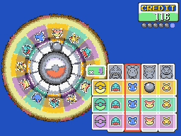

# Roulette Minigame
This script is for Pokémon Essentials. It's the Roulette Game Corner minigame from Ruby/Sapphire/Emerald. This minigame isn't an exact adaptation of the official one, the ball never stops at an occupied slot, so there's no Taillow and Shroomish bonus. The ball chance is 1/free slots quantity.

## Screens

## Compatibility
Tested on Essentials v13 and v18.1. Doesn't work with v19 or above.

## Installation
Follow the [Script](/Script.rb) instructions. The sample script files are in [Files folder](/Files).